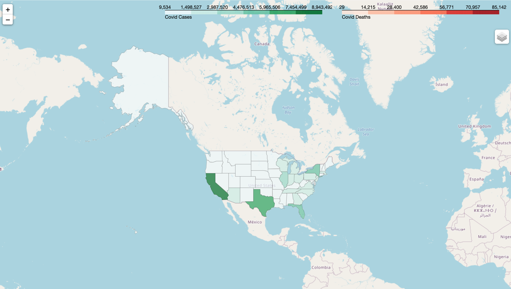

# Covid_Tracker
This is a US based covid tracker written in [python](https://www.python.org/) using [folium](https://python-visualization.github.io/folium/index.html), [pandas](https://pandas.pydata.org/docs/) and [regex](https://docs.python.org/3/library/re.html). Folium is a python package that uses the leaflet.js library to make maps. I also used the pandas package to sort, merge and clean json datasets provided by the ["Covid Act Now"](https://covidactnow.org/data-api) Api. This was necessary for [folium](https://python-visualization.github.io/folium/index.html) to compile correctly.  A live implementation is on [my website](https://www.marcomayorga.com/). Since it is a static hosted by [GitHub pages](https://pages.github.com/), I use a bash script to run the python script and move the map.html file generated and append it to my website. I also use a crontab to automate the bash file. 
